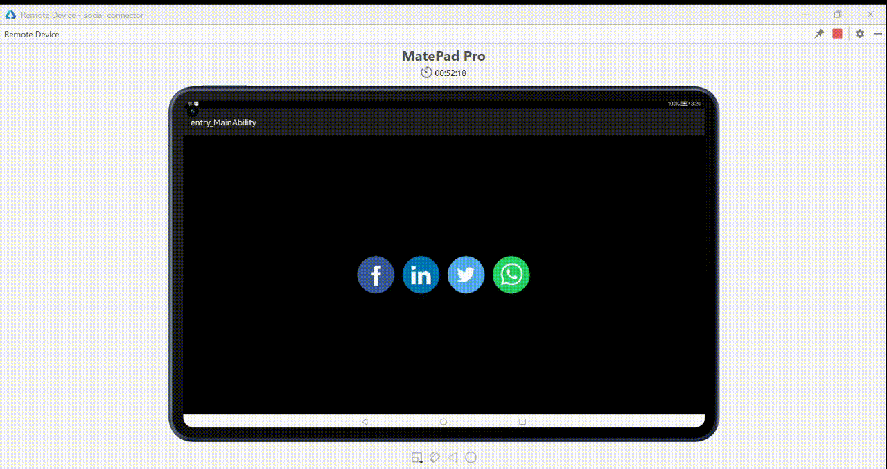

socialconnector
=================
[](https://github.com/applibgroup/HMOS-SocialButtons/actions/workflows/main.yml)
[](https://sonarcloud.io/dashboard?id=applibgroup_HMOS-SocialButtons)

Introduction
------------
An HMOS library for creating social connection through icons

DEMO
----------


## How to use

## Installation
In order to use the library, add the following line to your **root** gradle file:

I) For using socialconnector module in sample app, include the source code and add the below dependencies in entry/build.gradle to generate hap/support.har.
```
dependencies {
            implementation fileTree(dir: 'libs', include: ['*.jar', '*.har'])
            implementation project(path: ':socialconnector')
            testImplementation 'junit:junit:4.13'
            ohosTestImplementation 'com.huawei.ohos.testkit:runner:1.0.0.100'
}
```
II) For using socialconnector in separate application using har file, add the har file in the entry/libs folder and add the dependencies in entry/build.gradle file.
```
dependencies {
            implementation fileTree(dir: 'libs', include: ['*.jar'])
            testImplementation 'junit:junit:4.13'
}
```
III) For using socialconnector from a remote repository in separate application, add the below dependencies in entry/build.gradle file.
```
dependencies {
        implementation 'dev.applibgroup:socialconnector:1.0.0'
        testImplementation 'junit:junit:4.13'
}
```

#### Usage
For example a Facebook Icon, use the following in your xml   
```    
     <com.example.socialconnector.SocailConnect
        ohos:height="match_content"
        ohos:width="match_content"
        ohos:id="$+id:image1"
        ohos:padding="10vp"
        ohos:image_src="$media:facebook"
        ohos:clickable="true"/>
```

### Credits 
* [DesignPieces collection of social colors](http://designpieces.com/2012/12/social-media-colours-hex-and-rgb/)

Support and extension
---------------------

Currently there is a limitation to

i) set image source  from library end. So, app developer has to set through xml as shown below if he/she wants for other icons:
`ohos:image_src="$media:whatsapp"`
`ohos:image_src="$media:LinkedIN"`
`ohos:image_src="$media:Twitter"`

ii) And Also This Library is for this four icons only as of now

iii) And also this icons will provide some animation effect onclicking the icon.


## License 
This software is licensed under the Apache License V2.0
A copy can be found [here](./LICENSE.md)
